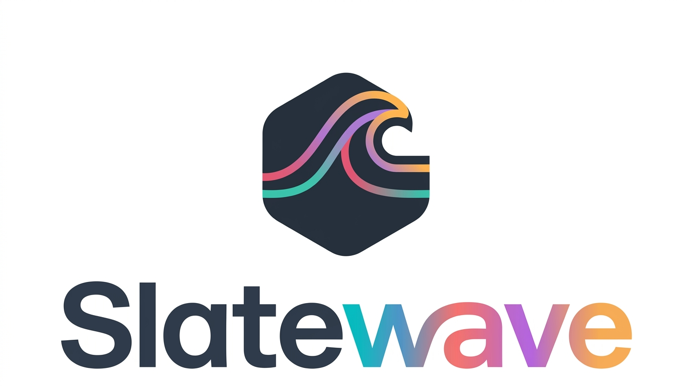

<div align="center">



# Slatewave (Ghostty)

A Slatewave theme for [Ghostty](https://ghostty.org) — slate foundation, teal signature. Part of the [Slatewave family](#slatewave-family) — one palette across editors, terminals, prompts, notes, and more.

> _Slate below, teal above._

</div>

---

## What it styles

Slatewave for Ghostty is a single theme file tuned against Ghostty's native color keys. It sets:

- **ANSI 0–15** — mirrored from the VSCode Slatewave terminal block so `ls --color`, `git diff`, and 256-color TUIs all read identically across your editor and terminal
- **Background** — slate `#282c34`, matching the VSCode editor background
- **Foreground** — slate-200 `#e2e8f0`, matching the VSCode editor foreground
- **Cursor** — teal `#5eead4` with slate-background text, so the block cursor stays legible
- **Selection** — slate-700 `#334155` with slate-200 text, for a calm, non-competing highlight

---

## Installation

### As a Ghostty theme

Ghostty loads user themes from `$XDG_CONFIG_HOME/ghostty/themes/` (typically `~/.config/ghostty/themes/`).

```sh
mkdir -p ~/.config/ghostty/themes
curl -fsSL https://raw.githubusercontent.com/kevinlangleyjr/ghostty-slatewave/main/Slatewave \
  -o ~/.config/ghostty/themes/Slatewave
```

Then add this line to `~/.config/ghostty/config`:

```ini
theme = Slatewave
```

Reload with `⌘⇧,` (macOS) or restart Ghostty.

### From a local clone

```sh
git clone https://github.com/kevinlangleyjr/ghostty-slatewave
cp ghostty-slatewave/Slatewave ~/.config/ghostty/themes/Slatewave
```

### Inline

If you'd rather not manage a separate theme file, paste the contents of [`Slatewave`](./Slatewave) directly into your `~/.config/ghostty/config` — the same keys work at the top level.

### Recommended config

For the cleanest match with the companion themes:

```ini
theme = Slatewave

font-family = "JetBrainsMono Nerd Font"
font-size = 14

cursor-style = block
cursor-style-blink = false

background-opacity = 1.0
background-blur = false

# If you use the oh-my-posh prompt
shell-integration = detect
```

---

## Palette

Slatewave shares its palette with the companion themes. The anchor colors:

| | Hex | Tailwind | Role |
|---|---|---|---|
|  | `#282c34` | — | **background** |
|  | `#334155` | slate-700 | selection background |
|  | `#1e293b` | slate-800 | ANSI 0 (black) |
|  | `#e2e8f0` | slate-200 | **foreground**, ANSI 7 (white) |
|  | `#5eead4` | teal-300 | **cursor**, ANSI 2 (green) |
|  | `#99f6e4` | teal-200 | ANSI 10 (bright green) |
|  | `#7dd3fc` | sky-300 | ANSI 12 (bright blue) |
|  | `#38bdf8` | sky-400 | ANSI 4 (blue) |
|  | `#b388ff` | — | ANSI 5 (magenta) |
|  | `#fb7185` | rose-400 | ANSI 1 (red) |
|  | `#fbbf24` | amber-400 | ANSI 11 (bright yellow) |

### ANSI mapping

Mirrors the `terminal.ansi*` block from [vscode-slatewave](https://github.com/kevinlangleyjr/vscode-slatewave/blob/main/themes/slatewave-color-theme.json) so shell output is consistent across editor and terminal.

| Slot | Normal | Bright |
|---|---|---|
| Black | `#1e293b` slate-800 | `#475569` slate-600 |
| Red | `#fb7185` rose-400 | `#ef5350` |
| Green | `#5eead4` teal-300 | `#99f6e4` teal-200 |
| Yellow | `#b45309` amber-700 | `#fbbf24` amber-400 |
| Blue | `#38bdf8` sky-400 | `#7dd3fc` sky-300 |
| Magenta | `#b388ff` | `#c4b5fd` violet-300 |
| Cyan | `#0e7490` cyan-700 | `#67e8f9` cyan-300 |
| White | `#e2e8f0` slate-200 | `#f1f5f9` slate-100 |

---

## Customize

The theme file is a plain Ghostty config fragment — every line is a `key = value` pair. To override a single color without forking, copy the relevant line into your `~/.config/ghostty/config` _after_ the `theme = Slatewave` line:

```ini
theme = Slatewave

# Override just the cursor
cursor-color = #99f6e4
```

Later keys win in Ghostty's config, so the override takes effect without editing the theme file itself.

---

## Slatewave family

One palette. Every tool.

- **Editors** — [VSCode](https://github.com/kevinlangleyjr/vscode-slatewave) · [Neovim](https://github.com/kevinlangleyjr/neovim-slatewave) · [Helix](https://github.com/kevinlangleyjr/helix-slatewave) · [Zed](https://github.com/kevinlangleyjr/zed-slatewave) · [Sublime Text](https://github.com/kevinlangleyjr/sublime-text-slatewave) · [JetBrains](https://github.com/kevinlangleyjr/jetbrains-slatewave)
- **Terminals** — [Alacritty](https://github.com/kevinlangleyjr/alacritty-slatewave) · [iTerm2](https://github.com/kevinlangleyjr/iterm2-slatewave) · [WezTerm](https://github.com/kevinlangleyjr/wezterm-slatewave) · [Windows Terminal](https://github.com/kevinlangleyjr/windows-terminal-slatewave)
- **Prompts** — [Oh My Posh](https://github.com/kevinlangleyjr/slatewave-omp) · [Starship](https://github.com/kevinlangleyjr/starship-slatewave)
- **Multiplexer** — [tmux](https://github.com/kevinlangleyjr/tmux-slatewave)
- **Notes** — [Obsidian](https://github.com/kevinlangleyjr/obsidian-slatewave) · [Logseq](https://github.com/kevinlangleyjr/logseq-slatewave)
- **Launchers** — [Alfred](https://github.com/kevinlangleyjr/alfred-slatewave) · [Raycast](https://github.com/kevinlangleyjr/raycast-slatewave)
- **Chat** — [Slack](https://github.com/kevinlangleyjr/slack-slatewave)

See [getslatewave.com](https://getslatewave.com) for the full family.

---

## Contributing

Issues and PRs welcome. For palette changes, include a before/after screenshot of the same terminal session (`ls --color`, `git diff`, a TUI like `lazygit` or `btop`) so the visual tradeoff is obvious.

---

## License

WTFPL — Do What The Fuck You Want To Public License. See [LICENSE](LICENSE).
